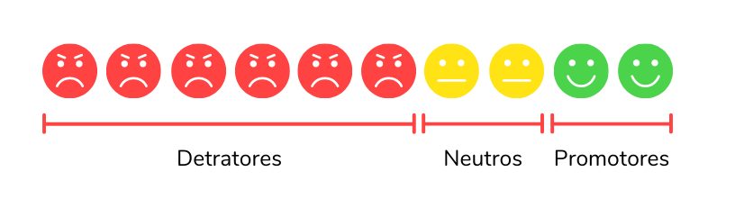

# **Next Level Week 04 Edition**
 
## :sparkles: Descrição
O projeto consiste em um API, no qual será calculado o **NPS(Net Promoter Score)**, este foi desenvolvido durante a realização da 4ª Edição da NLW (Next Level Week), promovido pela [Rocketseat](https://rocketseat.com.br/) e ministrada pela instrutora [Daniela Leão](https://github.com/danileao). 

## :notebook_with_decorative_cover: O que é NPS ?

O NPS é a abreviação para Net Promoter Score, é uma metodologia de satisfação de clientes, desenvolvida para avaliar o grau de fidelidade dos clientes de qualquer perfil de empresa. Para mais detalhes,[clique aqui!](https://www.zenvia.com/blog/como-calcular-o-nps-da-sua-empresa/).

## :wrench: Tecnologias
Este projeto foi desenvolvido em Node.js com as seguintes tecnologias:
* [Express](https://expressjs.com/pt-br/) ;
* [Ethereal Email](https://ethereal.email/) 
* [Jest](https://jestjs.io/pt-BR/);
* TypeScript ;
* [TypeORM](https://typeorm.io/) ;
* [Beekeeper](https://www.beekeeperstudio.io/) (editor de SQL e gerenciador de Banco de Dados) ;
* [Insomia](https://insomnia.rest/) ;

## :computer: Como executar
Para executar o projeto realize os seguintes passos:
1. Instale o [Node.js]() em sua maquina.
2. Instale o gerenciador de pacotes [yarn](https://yarnpkg.com/).
3. Clone o projeto em sua maquina;
4. Na pasta **api** do projeto, rode o comando `yarn install` para instalar as dependencias necessárias para a execução da aplicação.
5. Após rodar o comando acima, rode `yarn dev` para execultar a aplicação.

**OBS.:** há aplicação poderá ser acessada em `localhost:3333` .

## 
Feito com muito :heart: por **Natanael Vieira**
